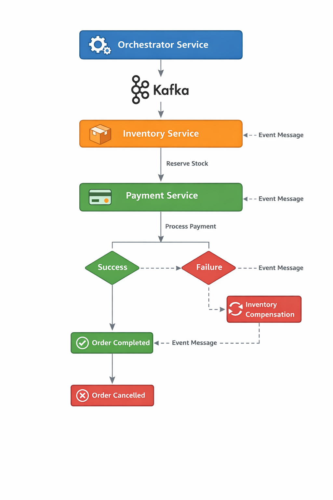

# Saga Orchestration Microservices

[]()
[]()
[]()
[]()
[]()

Projeto demonstrando uma arquitetura de microserviços utilizando o padrão **Saga Orchestration**, com comunicação assíncrona via Kafka.

---

# Arquitetura



---

# Visão Geral

Este sistema simula um fluxo de processamento de pedidos com os seguintes serviços:

* **orchestrator-service** → coordena a Saga
* **sale-service** → inicia o pedido
* **inventory-service** → reserva estoque
* **payment-service** → processa pagamento
* **Kafka** → comunicação assíncrona entre serviços
* **MySQL** → persistência dos dados

---

# Fluxo da Saga

1. Orchestrator inicia o pedido
2. Inventory Service reserva o estoque
3. Payment Service processa o pagamento
4. Se sucesso → pedido concluído
5. Se falha → compensação executada

---

# Stack Tecnológica

* Java 25
* Spring Boot
* Maven
* Apache Kafka
* MySQL 8
* Docker
* Docker Compose

---

# Estrutura do Projeto

```
orquestrado_base/
│
├── docker-compose.yml
├── README.md
│
├── docs/
│   └── images/
│       └── saga-orchestration.png
│
├── docker/
│   └── mysql/
│       └── init/
│           └── 01-init.sql
│
├── services/
│   ├── orchestrator-service/
│   ├── sale-service/
│   ├── inventory-service/
│   └── payment-service/
```

---

# Como Executar

## Pré-requisitos

* Docker Desktop instalado

---

## Subir ambiente completo

```bash
docker compose up -d --build
```

---

## Verificar containers

```bash
docker compose ps
```

---

## Ver logs

```bash
docker compose logs -f orchestrator-service
```

---

# Portas

| Serviço              | Porta |
| -------------------- | ----- |
| orchestrator-service | 8085  |
| sale-service         | 8081  |
| inventory-service    | 8082  |
| payment-service      | 8083  |
| Kafka                | 9092  |
| MySQL                | 3306  |

---

# Banco de Dados

Bancos criados automaticamente:

* saga_sale
* saga_inventory
* saga_payment

---

# Objetivo

Este projeto demonstra:

* Saga Pattern (Orchestration)
* Arquitetura orientada a eventos
* Comunicação assíncrona
* Microservices architecture
* Integração com Kafka

---

# Autor

Projeto de estudo e demonstração de arquitetura de microserviços.
